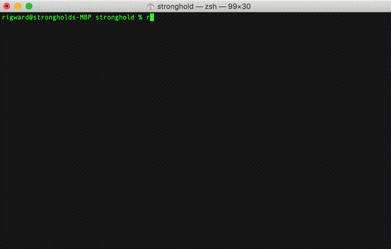

# Reverse Polish Notation calculator

I started this project to build a complete, polished, but _small_ product: A 
[reverse polish notation calculator](https://en.wikipedia.org/wiki/Reverse_Polish_notation) in the style of a unix command line tool.

Result looks like this:

## References

While developing the implementation for this project, I found the following references useful:

* [Wikipedia: Reverse Polish Notation](https://en.wikipedia.org/wiki/Reverse_Polish_notation)
* [RPN Tutorial](https://hansklav.home.xs4all.nl/rpn/)

## Tech description

* A command line tool called `rpn` is written in Python 3.7
* The command line tool operates like other unix command line tools.
* Can be easily run on common unix systems (linux, mac os x)
* While building this, I thought about what happens in expected (and unexpected) error situations. This tool might be used 
in pipelines, interactively and in a shell script.  

Since product design is a significant part of this project, I implemented a fair bit of variation in the details and the command set.
For example, a programmer working on a low level project might expect binary and hex input/output:  

    $ rpn
    > bin  
    > 0xaa55    
    0b1010101001010101 > 2 |  
    0b1010101001010111 > 1 ~ &  
    0b1010101001010110 >  

And someone interested in factorials may expect more than the usual level of precision:

    $ rpn
    > 50 fact
    30414093201713378043612608166064768844377641568960512000000000000 >
    
    
## Regular install:
1. Change the first line in the script (currently `#!/usr/bin/env python3`) to point to python 3.7 for case when python executable is located somewhere else
2. Copy rpn.py file to the appropriate folder with a shortcut name. (/usr/local/bin) is a good choice: `cp ./rpn.py /usr/local/bin/rpn`
3. Set proper permissions: `sudo chown 755 /usr/local/bin/rpn`
4. Start the program in terminal: `rpn`

## Docker container:

`docker build --tag rpn:1.0 .`
 
`docker run -it rpn:1.0 rpn`

## Command Line Help

This is the command line help from my implementation:

    USAGE:

      rpn                          Launch in interactive mode
      rpn [expression]             Evaluate a one-line expression

    RC FILE

      rpn will execute the contents of ~/.rpnrc at startup if it exists.

    EXAMPLES

      rpn 1 2 + 3 + 4 + 5 +              => 15
      rpn pi cos                         => -1.0
      rpn                                => interactive mode

    ARITHMETIC OPERATORS

      +          Add
      -          Subtract
      *          Multiply
      /          Divide
      cla        Clear the stack and variables
      clr        Clear the stack
      clv        Clear the variables
      clm        Clear the macros
      !          Boolean NOT
      !=         Not equal to
      %          Modulus
      ++         Increment
      --         Decrement

    Bitwise Operators

      &          Bitwise AND
      |          Bitwise OR
      ^          Bitwise XOR
      ~          Bitwise NOT
      <<         Bitwise shift left
      >>         Bitwise shift right

    Boolean Operators

      &&         Boolean AND
      ||         Boolean OR
      ^^         Boolean XOR

    Comparison Operators

      <          Less than
      <=         Less than or equal to
      ==         Equal to
      >          Greater than
      >=         Greater than or equal to

    Trigonometric Functions

      acos       Arc Cosine
      asin       Arc Sine
      atan       Arc Tangent
      cos        Cosine
      cosh       Hyperbolic Cosine
      sin        Sine
      sinh       Hyperbolic Sine
      tanh       Hyperbolic tangent

    Numeric Utilities

      ceil       Ceiling
      floor      Floor
      round      Round
      ip         Integer part
      fp         Floating part
      sign       Push -1, 0, or 0 depending on the sign
      abs        Absolute value
      max        Max
      min        Min

    Display Modes

      hex        Switch display mode to hexadecimal
      dec        Switch display mode to decimal (default)
      bin        Switch display mode to binary
      oct        Switch display mode to octal

    Constants

      e          Push e
      pi         Push Pi
      rand       Generate a random number

    Mathematic Functions

      exp        Exponentiation
      fact       Factorial
      sqrt       Square Root
      ln         Natural Logarithm
      log        Logarithm
      pow        Raise a number to a power

    Networking

      hnl        Host to network long
      hns        Host to network short
      nhl        Network to host long
      nhs        Network to host short

    Stack Manipulation

      pick       Pick the -n'th item from the stack
      repeat     Repeat an operation n times, e.g. '3 repeat +'
      depth      Push the current stack depth
      drop       Drops the top item from the stack
      dropn      Drops n items from the stack
      dup        Duplicates the top stack item
      dupn       Duplicates the top n stack items in order
      roll       Roll the stack upwards by n
      rolld      Roll the stack downwards by n
      stack      Toggles stack display from horizontal to vertical
      swap       Swap the top 2 stack items

    Macros and Variables

      macro      Defines a macro, e.g. 'macro kib 1024 *'
      x=         Assigns a variable, e.g. '1024 x='

    Other

      help       Print the help message
      exit       Exit the calculator

## Pipelines and redirection:

    echo 1 2 + | rpn > results.txt

    cat 1.txt | rpn

    rpn < 1.txt
